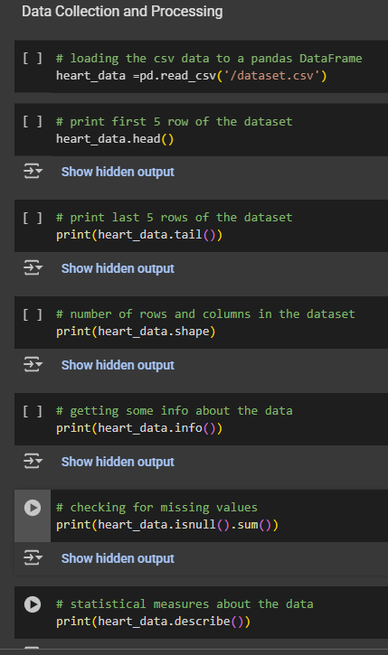
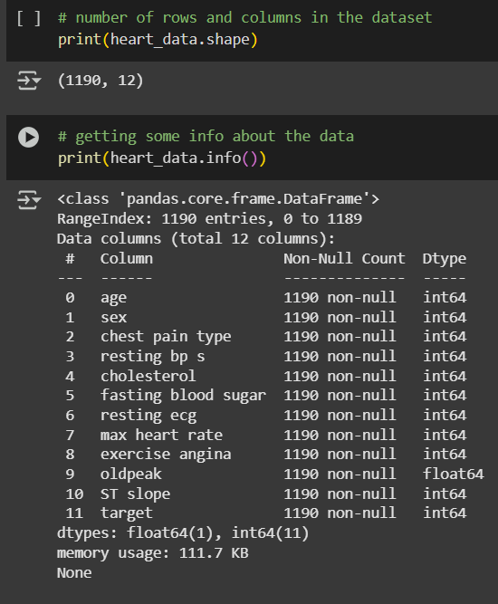
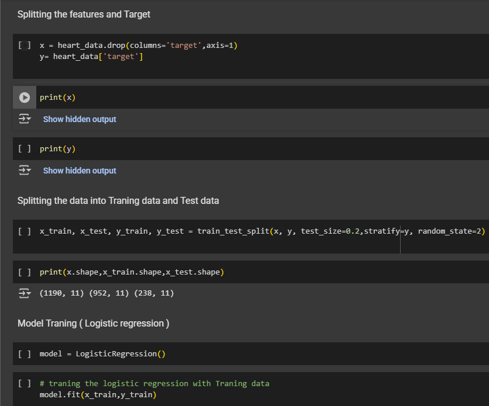
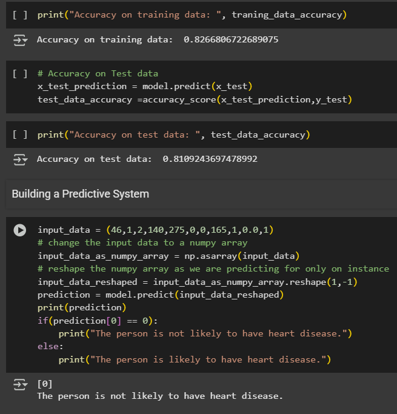

# ❤️ Heart Disease Prediction using Machine Learning (Google Colab)

A machine learning project that predicts the presence of heart disease using **Logistic Regression**. The project is built and executed entirely on **Google Colab** using **Python**, **pandas**, and **scikit-learn**.

---

## 📸 Screenshots

### 📊 Dataset Preview

### 🔍 Data Cleaning & Correlation Heatmap

### 🧠 Model Training & Accuracy

### 🩺 Sample Prediction Output

---

## 🧠 Project Overview

This notebook-based ML project aims to detect the possibility of heart disease based on patient data like age, sex, cholesterol level, blood pressure, etc. The dataset is analyzed and cleaned using `pandas`, followed by training a **Logistic Regression** model to make predictions.

---

## 📌 Features

- ✔️ Data cleaning and exploration using `pandas`
- ✔️ Model training and evaluation using `LogisticRegression`
- ✔️ Predictions on custom input
- ✔️ Visualization of results (optional)
- ✔️ Runs entirely on **Google Colab** (no setup needed)

---

## 📊 Dataset

- **Source**: [UCI Machine Learning Repository - Heart Disease Dataset](https://github.com/shivamwebsite/Forest-Cover_Predictions)
- **Attributes**:
  - `age`, `sex`, `cp` (chest pain), `trestbps`, `chol`, `fbs`, `restecg`, `thalach`, `exang`, etc.
- **Target**:
  - `0`: No heart disease  
  - `1`: Presence of heart disease

---

## 📁 File Structure

    ├── HeartDiseasePrediction.ipynb # Main Colab notebook
    ├── heart.csv # Dataset file (uploaded in Colab)
    ├── assets/
        └── accuracy_plot.png # (Optional) Accuracy or confusion matrix visuals

---

## ▶️ How to Run on Google Colab

1. Open the Colab notebook:
   
       

3. Upload the dataset:
   
         - Make sure to upload `heart.csv` to the Colab runtime.

4. Run the cells step by step:
   
       - Data preprocessing
       - Model training
       - Evaluation and prediction

---

## 📈 Example Output

Training Accuracy: 85.2%
Confusion Matrix:

          [[40 6]
          [ 5 49]]

---

## 🧪 Technologies Used

    - Python 🐍
    - Google Colab
    - Pandas
    - Scikit-learn
    - NumPy

---

## 🙋‍♂️ Author

**Shivam Shaw**

    - [LinkedIn](linkedin.com/in/shivam-shaw-a9288a272)

---

## 📜 License

This project is licensed under the MIT License - see the [LICENSE](LICENSE) file for details.
